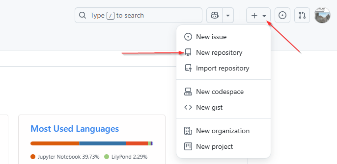
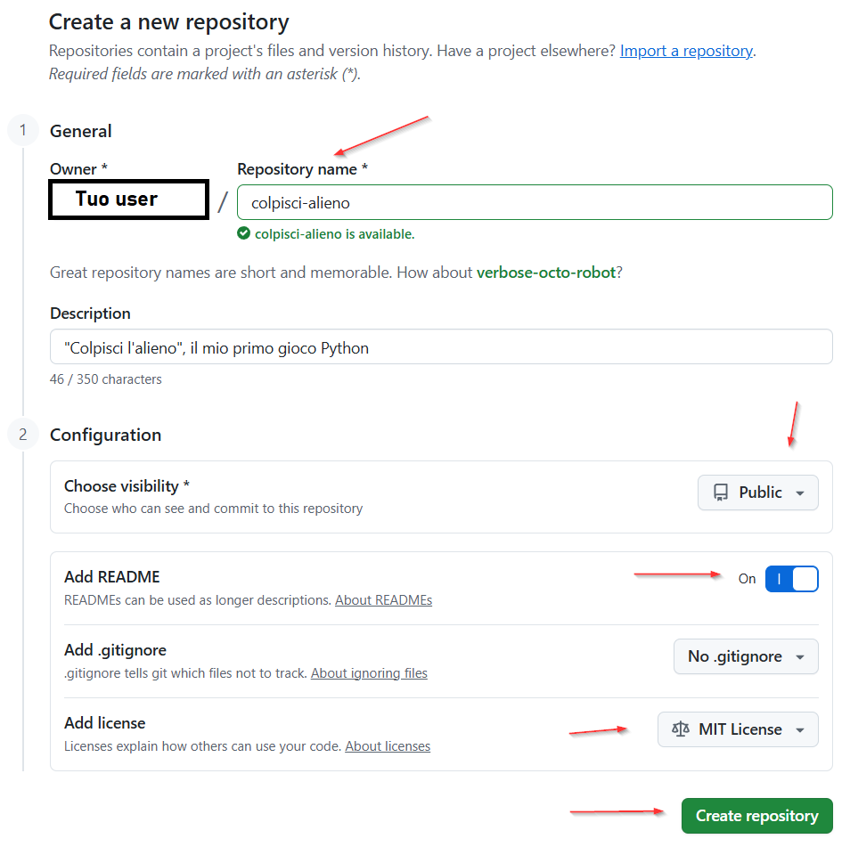
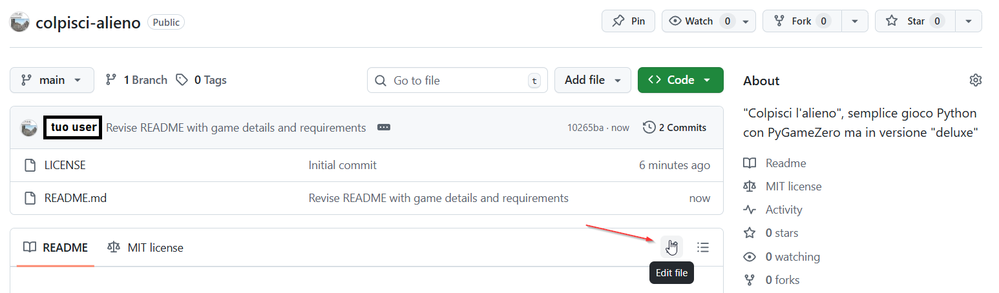
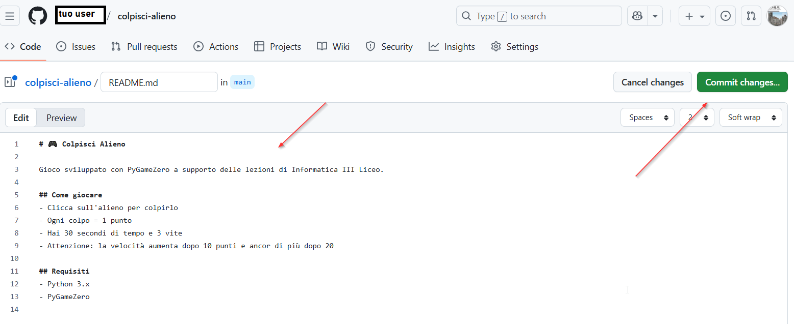
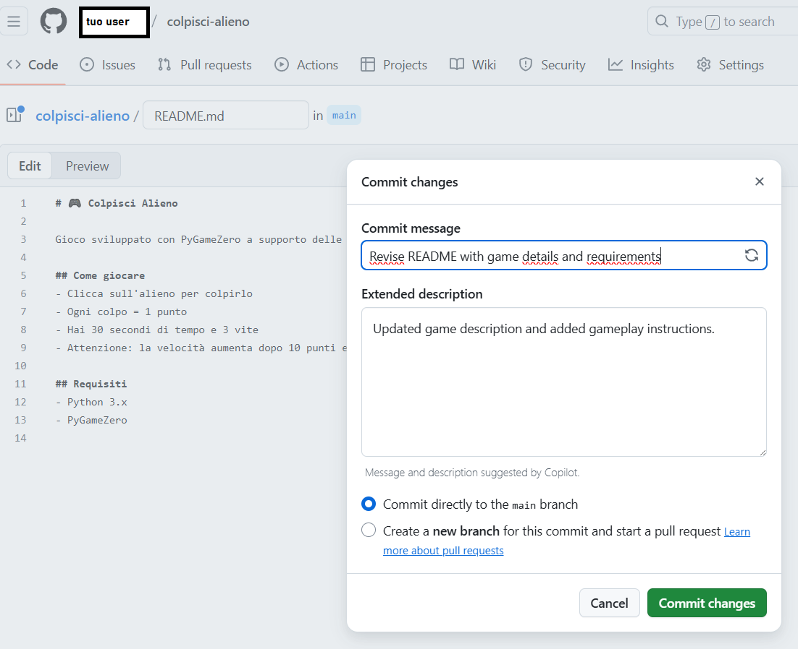
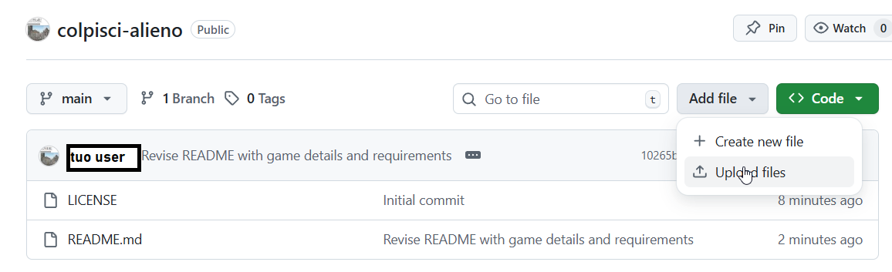
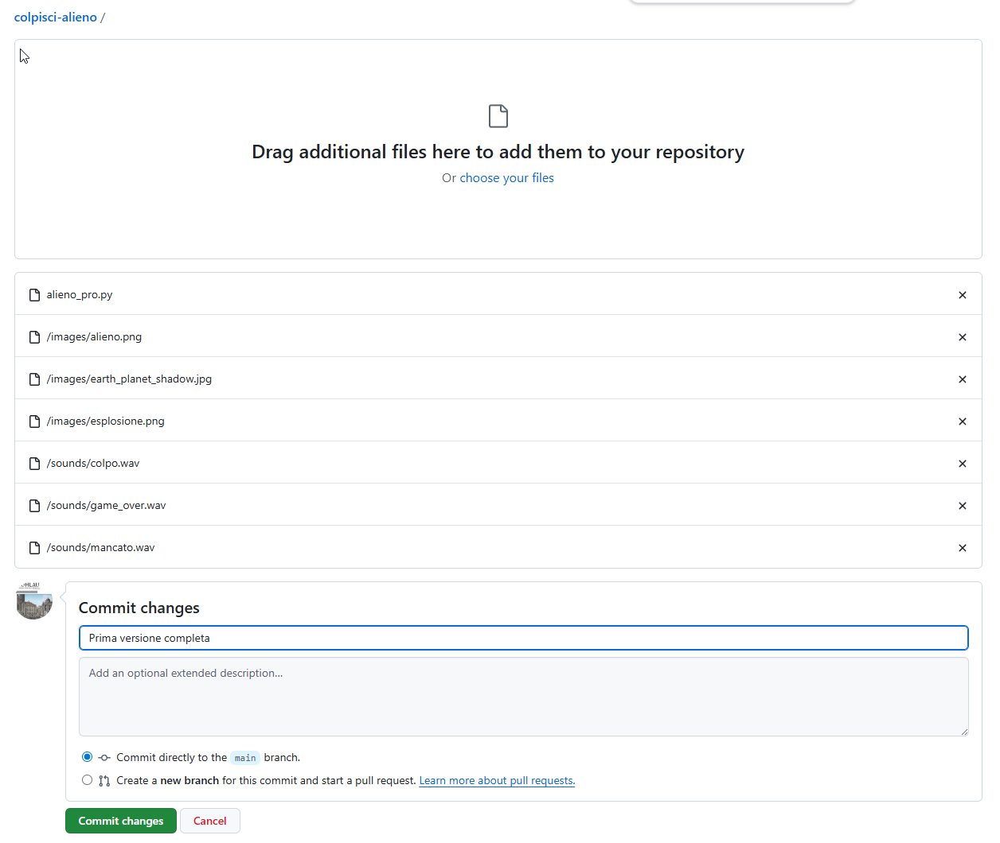
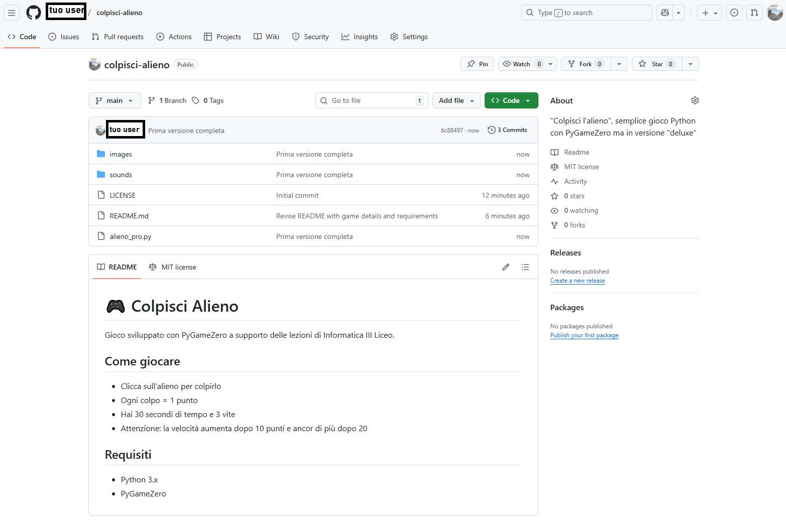

# 🐍 Versionamento del codice, Git & GitHub

**Ovvero: perché il tuo codice merita meglio di "alieno_VERO_definitivo_v2_QUESTO_SI.py"**

<br>

💻 **III Liceo Scientifico Biella - Scienze Applicate**
🐍 **Python Biella Group**

---

# 📁 Il problema del "filename hell"

```
alieno.py
alieno_v2.py
alieno_v2_funzionante.py
alieno_v2_funzionante_VERO.py
alieno_v2_funzionante_VERO_definitivo.py
alieno_v2_funzionante_VERO_definitivo_prof_non_guardare.py
```

**Domanda esistenziale:** Quale versione consegno? 🤔

---

# 🗂️ Perché il versionamento è fondamentale?

ovvero: *"Perché chiamare un file `VERA_VERSIONE_BUONA_definitiva3(questa_lo_giuro).py` non funziona"*

- Evita **file duplicati** con nomi imbarazzanti  
- Ti permette di **tornare indietro nel tempo** (senza costruire un acceleratore di particelle)  
- Tiene traccia di **chi ha fatto cosa**, e **quando**  
- Permette di sperimentare senza paura di distruggere tutto 🤯  
- È lo *standard* nel mondo della programmazione

---

# 🎭 La tragedia del lavoro di gruppo

**Immaginate di lavorare sul gioco in gruppo:**
- Marco scrive il codice degli alieni
- Sofia aggiunge i punteggi
- Luca modifica... tutto quello che avevano fatto Marco e Sofia
- Risultato: **CAOS ASSOLUTO** 💥

*"Ma io avevo già fatto quella parte!" - cit. ogni progetto di gruppo*

---

# 👥 Versionamento per lavorare in gruppo
## Ovvero: “Come evitare guerre civili nel team”

- Evita il classico: “CHI HA ROTTO IL CODICE?!” 😡  
- Permette **rami separati** per lavorare su parti diverse  
- Unisce il lavoro con **merge** e **pull request** (li vedremo presto in dettaglio) 
- Ogni modifica è documentata come in un’indagine scientifica 🔍  
- Perfetto per progetti scolastici… e per non litigare con i compagni

---

<!-- _class: lead -->

# 🦸‍♂️ Enter: il Version Control System (VCS)

*Il supereroe di cui non sapevi di avere bisogno*

---

# 🛠️ Cos'è un Version Control System?

Un sistema che:
- **Traccia** ogni modifica al codice
- **Ricorda** chi ha fatto cosa e quando
- **Permette** di tornare indietro nel tempo (e recuperare versioni precedenti)
- **Gestisce** il lavoro in parallelo di più persone

**In pratica:** La macchina del tempo per il tuo codice! ⏰

---

# 🎮 Git: il boss finale dei VCS


- Creato da Linus Torvalds (sì, quello di Linux)
- Lo usano Google, Microsoft, NASA, e... presto anche voi!
- È lo standard de facto per il codice, come WhatsApp lo è per i messaggi

---

# 🌟 Git vs il caos

| Senza Git | Con Git |
|-----------|---------|
| 50 file con nomi assurdi | 1 progetto, infinite versioni |
| "Chi ha rotto il codice?" | Tracciato ogni singolo byte |
| Lavoro sovrascritto | Merge intelligente |
| Backup su chiavetta USB | Cloud infinito |

---

<!-- _class: lead -->

# ⚔️ SFIDA

**Trova l'errore nel nome file:**
`progetto_pygame_FINALISSIMO_vers3_corretto_ok_davvero.py`

*Risposta: tutto. Tutto è l'errore.* 😅

---

# 🌐 GitHub: il social network per nerd


- Git + Hub = dove vive il tuo codice
- Portfolio professionale per sviluppatori
- Una piattaforma online per ospitare repository Git  
- Ottima per **condividere progetti**, collaborare, imparare  
- Gratuita per studenti  
- Piena di progetti da cui trarre idee… o traumi  
- Quella cosa che vi servirà per consegnare i progetti al prof 👀

---

# 📝 Creare un account GitHub

**Step 1:** Vai su [github.com](https://github.com)
**Step 2:** Click su "Sign up"
**Step 3:** Scegli username *SENZA* riferimenti imbarazzanti
  - ✅ `mario_rossi_dev`
  - ❌ `ilmegagamer2009`
  - ❌ `odioinformatica`

**Pro tip:** Usate l'email della scuola per vantaggi studente!

---

# 🎯 Username: scegli con saggezza

Ricordate: questo username potrebbe finire sul vostro CV!

**Hall of Shame:**
- `xXx_CodeMaster_xXx`
- `programmatore_super_mega`
- `nettonoob123`

*Fra 5 anni ringrazierete di aver scelto qualcosa di professionale* 💼

---

# ⚔️ SFIDA

**Quale di questi username usereste per candidarvi a Google?**
a) `l33t_h4ck3r`
b) `giulia.verdi`
c) `pizza_pasta_mandolino`

*Se avete scelto (a) o (c), potreste pentiverne in futuro...* 😬

---

# 📥 Scaricare un progetto da GitHub
## a.k.a. “Quando il prof dice: clonalo!”

**Metodo 1: Il bottone verde (per NOOB)**
1. Trova il repository
2. Click su "Code" (il bottone verde)
3. "Download ZIP"
4. Estrai e apri in Thonny

*È come scaricare musica, ma legale!* 🎵

*Il metodo 2, tramite terminale lo vedremo la prossima volta*

---

# 🎮 Il nostro progetto: Colpisci Alieno

Ricordate il gioco del precedente incontro?

```python
import pgzrun

# L'alieno che tutti volevamo colpire durante le verifiche
alieno = Actor('alien')
alieno.pos = 100, 56

def draw():
    screen.fill((0, 0, 255))
    alieno.draw()

pgzrun.go()
```

*Ora vi facciamo vedere come metterlo su GitHub, come dei veri professionisti!* 👨‍💻

---

# 📦 Creare il tuo primo repository

**Step su GitHub:**
1. Click sul "+" in alto a destra
2. "New repository"
3. Nome: `colpisci-alieno` o vs nome (no spazi!)
4. Descrizione: "Il mio primo gioco Python"
5. ✅ "Add a README file"
6. Click "Create repository"

*Congratulazioni! Avete appena creato casa per il vostro codice!* 🏠

---
<style scoped>
img {
  display: block;
  margin: 0 auto;
}
</style>

## Click sul "+" in alto a destra
## "New repository"



---
<style scoped>
img {
  display: block;
  margin: 0 auto;
}
</style>



---


# 📝 Il README.md: la vetrina del progetto

```markdown
# 🎮 Colpisci Alieno

Gioco sviluppato con PyGameZero durante le lezioni di Informatica III Liceo.

## Come giocare
- Clicca sull'alieno per colpirlo
- Ogni colpo = 1 punto
- Non farti sfuggire l'alieno!

## Requisiti
- Python 3.x
- PyGameZero
```

*Il README è come il riassunto del libro: tutti lo leggono per primo!*

---

<style scoped>
img {
  display: block;
  margin: 0 auto;
}
</style>



---

<style scoped>
img {
  display: block;
  margin: 0 auto;
}
</style>




---

<style scoped>
img {
  display: block;
  margin: 0 auto;
}
</style>



---

# ⚔️ SFIDA

**Quale README è meglio?**

**A)** "progetto gioco"

**B)** "# Colpisci Alieno
Gioco Python con PyGameZero. Clicca l'alieno per vincere!"

*Se pensate (A), rileggete le slide precedenti* 😉

---

# 🚀 Caricare il codice su GitHub

**Metodo GUI (per oggi):**
1. Nel tuo repository, click "Add file" → "Upload files"
2. Drag & drop di:
   - `alieno.py` (il tuo codice)
   - cartella `images/` (con alien.png)
   - cartella `sounds/` (se hai suoni)
3. Scrivi un messaggio: "Aggiunto gioco colpisci alieno"
4. Click "Commit changes"

---

<style scoped>
img {
  display: block;
  margin: 0 auto;
}
</style>




---

<style scoped>
img {
  display: block;
  margin: 0 auto;
}
</style>




---

# 💬 L'arte del commit message

**❌❌❌❌❌ Messaggi terribili:**
- "fix"
- "roba"
- "asdfghjkl"
- "funziona, non chiedete come"

**✅ Messaggi professionali:**
- "Aggiunta funzione punteggio"
- "Risolto bug movimento alieno"
- "Implementato sistema di livelli"

*Scrivete come se il vostro futuro io dovesse capire!*

---

# 📋 Standard dei progetti GitHub

**Ogni progetto dovrebbe avere:**
- ✅ `README.md` - la guida del progetto
- ✅ `.gitignore` - file da ignorare (es. `__pycache__`)
- ✅ `LICENSE` - come possono usare il tuo codice
- ✅ Struttura organizzata:
  ```
  colpisci-alieno/
  ├── README.md
  ├── alieno.py
  ├── images/
  └── sounds/
  ```

---

<style scoped>
img {
  display: block;
  margin: 0 auto;
}
</style>



---

# 🗂️ Il .gitignore: l'amico invisibile

❌❌❌❌❌ File temporanei, privati o inutili, da NON caricare su GitHub:

```
# Python
__pycache__/
*.pyc
*.pyo

# Thonny
.thonny/

# OS
.DS_Store
Thumbs.db

# File personali
password.txt
```

*Git ignora questi file come voi ignorate i messaggi della chat di classe* 🙈

---

# 🏆 Prime buone pratiche GitHub

1. **Commit frequenti** - piccoli e con messaggi significativi
  - ❌ “fix”  
  - ✔️ “Risolto bug collisione alieno”  
2. **Documentazione** - README chiaro e aggiornato
3. **Cartelle ordinate** - (`src`, `assets`…) 
4. **Usare `.gitignore`** - per evitare di caricare file inutili  
5. **Usa nomi file significativi** - No file chiamati `prova.py`, `pippo.py`, `codice_fatto_male.py` 😬  

---

<!-- _class: lead -->

# ⚔️ SFIDA PER IL PROSSIMO INCONTRO

1. Create account GitHub (FATTO)
2. Create repository "colpisci-alieno"
3. Caricate il codice del gioco
4. Scrivete un README decente
5. Committate e inviate il link al prof

**Bonus:** Chi scrive il commit message più creativo vince... niente, ma ha il nostro rispetto! 🏅

---

# 🎓 Recap: cosa abbiamo imparato

- ✅ Version control ti salva la vita
- ✅ Git è il tuo migliore amico (quando lo capisci)
- ✅ GitHub è la tua vetrina = social per sviluppatori
- ✅ README = prima impressione del progetto
- ✅ Commit message = diario del codice
- ✅ .gitignore = privacy per il codice
- ✅ Thonny è il tuo laboratorio
- ✅ “Colpisci Alieno” è il tuo primo capolavoro intergalattico 👾🚀  

🎉 Ora è ufficiale: sei uno sviluppatore "pubblicato" che **non rinomina file a caso** 🥳

---

# 🚀 Prossimi passi

**Nei prossimi incontri su questo tema:**
- Git da terminale in Thonny
- Clone e push
- Branch e merge
- Pull request
- Gestione conflitti
- Workflow professionali
- GitHub Actions (CI/CD)

*Diventerete talmente bravi che vorrete versionare anche i compiti di letteratura!* 📚

---
<style scoped>
img {
  display: block;
  margin: 0 auto;
}
</style>

## Grazie per l'attenzione...

<br>


> *"C'è sempre qualcosa da imparare per migliorarci e crescere…**insieme!**"*