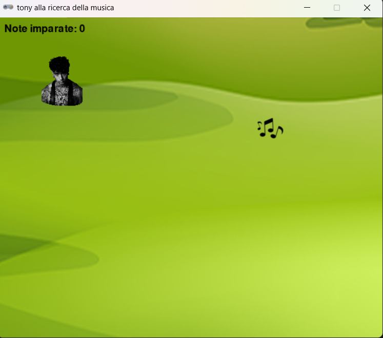

# 🎮 Pygame Zero
## 🎵 Tony alla ricerca della musica

💻 **III Liceo Scientifico Biella - Scienze Applicate**  
🐍 **Python Biella Group**

---

## Perché questo gioco?

🎯 In questo progetto impariamo:

- movimento manuale del protagonista tramite **tastiera**  
- gestione dello **stato del gioco**  
- timer con **clock.schedule()** e  collisioni con **colliderect()**  
- aggiornamento degli sprite (immagini)
- suoni, punteggi, game over  
- schermata di vittoria e riavvio del gioco

Tutto in poche righe.

---

## Anteprima del gioco

<style scoped>
img {
  display: block;
  margin: 0 auto;
}
</style>



> Tony deve raccogliere quante più note musicali possibili prima che scada il tempo! 
>Se supera il punteggio di vittoria, vince la partita!

---

## Configurazione iniziale

```python
from pgzero.actor import Actor
from pgzero.clock import clock
from pgzero.keyboard import keyboard
import pgzrun
from random import randint

TITLE = "Tony alla ricerca... della musica"
WIDTH = 800
HEIGHT = 600

# Costanti e variabili di gioco
DURATA_GIOCO = 30
VITTORIA_PUNTEGGIO = 20
punteggio = 0
game_over = False
musica_vittoria_suonata = False
```

---

## Creazione degli sprite

```python
# Creazione del personaggio principale
tony = Actor("tony")
tony.pos = 100, 100  # Posizione iniziale (x=100, y=100)

# Creazione della nota musicale da raccogliere
nota = Actor("nota musicale")
```

---

## Funzione `draw()` pt 1

```python
def draw():
    # Disegna l'immagine di sfondo (nuovo!)
    screen.blit("sfondo_bn", (0, 0))
    
    nota.draw()
    tony.draw()
    
    # Disegna il punteggio con ombra bianca
    screen.draw.text(
        "Note imparate: " + str(punteggio),
        color="black",
        topleft=(10, 10),
        shadow=(1, 1),
        scolor="#FFFFFF",
        fontsize=40,
    )
```

---

## Funzione `draw()` pt 2: Game Over

```python
if game_over:
    if punteggio > VITTORIA_PUNTEGGIO:
        # Schermata di vittoria
        screen.blit("vittoria", (0, 0))
        screen.draw.text(
            "Daje Tony, questo pezzo spacca!\nNote messe insieme: " 
            + str(punteggio),
            center=(WIDTH / 2, HEIGHT / 2),
            fontsize=60,
            color="white",
        )
        tony.image = "tony2"
        tony.pos = 400, 200
        tony.draw()
```

---

## Funzione `draw()` pt 3: Sconfitta

```python
    else:
        # Schermata di sconfitta
        screen.draw.text(
            "Peccato!\nDevi esercitarti di più.\nNote messe insieme: "
            + str(punteggio),
            midtop=(WIDTH / 2, 10),
            fontsize=40,
            color="red",
        )
    # Messaggio per ricominciare
    screen.draw.text(
        "Premi SPAZIO per ricominciare",
        center=(WIDTH / 2, HEIGHT - 100),
        fontsize=40,
        color="white",
    )
```

---

## Sistema di note musicali

```python
if nota_presa:
    punteggio += 1
    # Suona una nota diversa in base al punteggio
    if punteggio % 7 == 0:
        sounds.do.play()
    elif punteggio % 7 == 1:
        sounds.re.play()
    elif punteggio % 7 == 2:
        sounds.mi.play()
...
    elif punteggio % 7 == 6:
        sounds.si.play()

    piazza_nota()
```

---

## Funzione `update()` completa

```python
def update():
    global punteggio, game_over
    if not game_over:
        if keyboard.left:
            tony.x -= 5
        if keyboard.right:
            tony.x += 5
        if keyboard.up:
            tony.y -= 5
        if keyboard.down:
            tony.y += 5

        nota_presa = tony.colliderect(nota)        
        if nota_presa:
            # ... (sistema note musicali)
            piazza_nota()
```

---

## Funzione di reset del gioco

```python
def reset_gioco():
    global punteggio, game_over, musica_vittoria_suonata
    punteggio = 0
    game_over = False
    musica_vittoria_suonata = False
    tony.pos = 100, 100
    tony.image = "tony"
    piazza_nota()
    clock.schedule(tempo_scaduto, DURATA_GIOCO)
    sounds.last_note.stop()
```

🔄 Permette di ricominciare una nuova partita senza riavviare il programma!

---

## Gestione input da tastiera

```python
def on_key_down(key):
    global game_over
    if game_over and key == keys.SPACE:
        reset_gioco()
```

⌨️ Rileva la pressione del tasto SPAZIO per riavviare il gioco dopo il game over.

📌 **Didattica**: `on_key_down()` è diversa da `keyboard.left` - viene chiamata una sola volta quando si preme il tasto, invece che continuamente.

---

## Altre funzioni di supporto

```python
def piazza_nota():
    nota.x = randint(70, (WIDTH - 70))
    nota.y = randint(70, (HEIGHT - 70))

def tempo_scaduto():
    global game_over, musica_vittoria_suonata
    game_over = True
    # fai partire la canzone per la vittoria solo se si ha vinto (e falla partire solo una volta)
    if punteggio > VITTORIA_PUNTEGGIO and not musica_vittoria_suonata:
        sounds.last_note.play()
        musica_vittoria_suonata = True    
```

---

## Come funziona `Actor.move`?

<style scoped>
section {
  display: flex;
  flex-direction: column;
  align-items: center;
}
</style>


* `(0, 0)` è **in alto a sinistra**
* X aumenta → destra
* Y aumenta → in basso

`tony.x += 5` → Tony si muove a ...  
`tony.y -= 5` → Tony sale o scende?

---

## Movimento con keyboard

```python
if keyboard.left:
    tony.x -= 5
```

📌 **Didattica**:

* La tastiera è un *oggetto globale* gestito da Pygame Zero
* Ogni frame viene controllato se un tasto è premuto
* `update()` gira ~60 volte al secondo
* **Importante**: Il movimento ora è bloccato quando `game_over` è True

---

## `collidepoint` o `colliderect` ?

```
collidepoint((x, y))          colliderect(other)
      ┌─────────┐                ┌─────────┐
      │  Tony   │                │  Tony   │
      │    •    │ ← punto        │    ┌────┼────┐
      │         │                │    │    │    │
      └─────────┘                └────┼────┘    │
                                      │  Nota   │
                                      └─────────┘
  Punto dentro? True                Sovrapposizione? True
```

Nel nostro gioco usiamo:

```python
nota_presa = tony.colliderect(nota)
```

✔️ controlla se i due rettangoli (Tony e la nota) si sovrappongono  

---

## Punteggio e condizione di vittoria

```python
punteggio += 1  # Si incrementa di 1 ad ogni raccolta

# Alla fine del gioco
if punteggio > VITTORIA_PUNTEGGIO:
    # Vittoria!
else:
    # Sconfitta
```

📌 **Importante**:
- Esiste una soglia di vittoria (VITTORIA_PUNTEGGIO = 20)
- Due finali diversi in base al punteggio raggiunto

---

## Clock: programmare il futuro 🔮

Nel nostro gioco lo usiamo due volte:

```python
# All'inizio del gioco, parte il timer
clock.schedule(tempo_scaduto, DURATA_GIOCO)

# Nel reset, riparte il timer
clock.schedule(tempo_scaduto, DURATA_GIOCO)
```

❗ **Attenzione**: Quando si resetta il gioco, bisogna riprogrammare il timer!

💡 Il clock è uno strumento formidabile per creare giochi a tempo.

---

## Sistema a stati del gioco

```python
# Stati possibili:
# 1. Gioco in corso (game_over = False)
# 2. Game Over - Vittoria (game_over = True, punteggio > VITTORIA_PUNTEGGIO)
# 3. Game Over - Sconfitta (game_over = True, punteggio <= VITTORIA_PUNTEGGIO)
```

🧠 **Concetti**:
- Il gioco ha 3 stati distinti
- Ogni stato ha una visualizzazione diversa
- Lo stato determina quali azioni sono permesse

---

## Suoni: feedback musicale

```python
# Suoni di gioco (note musicali)
sounds.do.play()
sounds.re.play()
# ... ecc
# Suono di vittoria
sounds.last_note.play()

# Fermare un suono
sounds.last_note.stop()
```

🎵 **Stiamo usando un po' di suoni!**:
- 7 note musicali diverse (do, re, mi, fa, sol, la, si)
- Suono speciale per la vittoria
- Gestione dello stop del suono quando si resetta

---

## Il modulo 7 per le note musicali

```python
if punteggio % 7 == 0:
    sounds.do.play()
elif punteggio % 7 == 1:
    sounds.re.play()
# ... ecc
```

🎓 **Concetto matematico**: L'operatore modulo `%` ritorna il resto della divisione.

- Punteggio 0, 7, 14, 21 → suona DO
- Punteggio 1, 8, 15, 22 → suona RE
- E così via...

Questo crea una **scala musicale ciclica**!

---

## Posizionamento casuale della nota

```python
nota.x = randint(70, WIDTH - 70)
nota.y = randint(70, HEIGHT - 70)
```

🎯 Perché ±70?

* evita che la nota finisca mezzo fuori schermo
* centrato sulla dimensione dell'immagine (es. 128 px)

---

## Struttura cartelle consigliata

```
tony_musica/
│
├── gioco.py
├── images/
│   ├── tony.png
│   ├── tony2.png
│   ├── nota musicale.png
│   ├── sfondo_bn.png
│   └── vittoria.png
└── sounds/
    ├── do.wav
    ├── re.wav
    ├── ...
    ├── la.wav
    ├── si.wav
    └── last_note.wav
```

---

## Sfida 🤔

*Cosa succede se rimuovi il controllo `if not game_over:` dalla funzione update()?*

**A)** Il gioco non parte  
**B)** Tony può ancora muoversi dopo il game over  
**C)** Le note spariscono  
**D)** Il punteggio si azzera automaticamente

---

## Soluzione

**Risposta: B!**

Senza quel controllo, Tony continuerebbe a muoversi e raccogliere note anche dopo che il tempo è scaduto.

Il controllo dello stato è fondamentale per gestire correttamente il flusso del gioco!

---

## Debugging tips 🐛

- Tony non si muove → controlla `keyboard` e `if not game_over`
- La nota non si vede → immagine mancante in `/images/`
- Suono sbagliato → controlla la logica del modulo 7
- Il gioco non si resetta → verifica `reset_gioco()` e `on_key_down()`
- La vittoria non appare → controlla `VITTORIA_PUNTEGGIO`
- Tony continua a muoversi dopo game over → manca `if not game_over`
- Leggere sempre bene il **messaggio di errore**

---

## Possibili estensioni del gioco

💡 **Idee per migliorare il gioco:**

- Aggiungere ostacoli da evitare
- Creare livelli di difficoltà crescente (tempo e velocità)
- Implementare un sistema di vite
- Implementare nemici che si muovono
- Usate la creatività!
---

## 🎮🎮 Hai imparato 🎮🎮

* Movimento a tastiera con controllo dello stato
* Collisioni con Actor
* Clock e timer
* Gestione avanzata dello stato (3 stati)
* Sistema di vittoria/sconfitta
* Reset e riavvio del gioco
* Audio dinamico con note musicali

> "Programmare giochi è il modo più divertente per capire la logica e la gestione dello stato."

---
<style scoped>
img {
  display: block;
  margin: 0 auto;
}
</style>

## Buon divertimento con Tony!

<br>


> *"C'è sempre qualcosa da imparare per migliorarci e crescere…**insieme!**"*