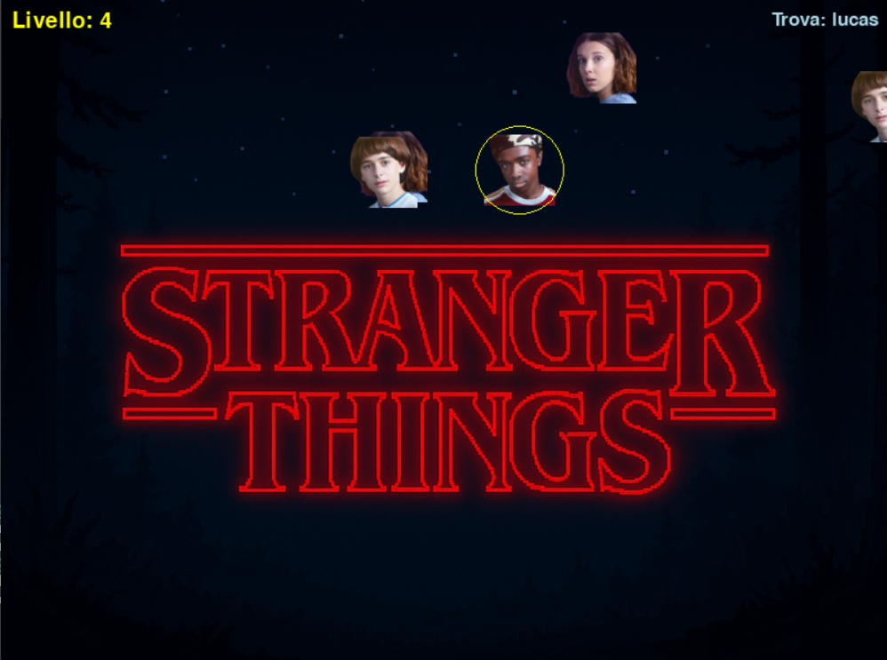

# 🎮 Pygame Zero

## 🌑 Stranger Stars – Salva il tuo personaggio!

💻 **III Liceo Scientifico Biella - Scienze Applicate**
🐍 **Python Biella Group**

---

## Perché questo gioco?

🎯 Con questo gioco vedremo:

* gestione del **mouse** per cliccare i personaggi (come per l'Alieno)
* creazione e movimento di più **Actor**
* logica dei **livelli** con difficoltà crescente
* gestione dello **stato di gioco** (scelta, gioco, game over)
* collisioni tramite **collidepoint()** (come per l'Alieno)
* animazioni con **oscillazione sinusoidale**

---

## Anteprima del gioco

<style scoped>
img { display: block; margin: 0 auto; }
</style>



> Clicca il personaggio giusto tra quelli che cadono!
> Sopravvivi al Sottosopra e raggiungi il livello piu alto che puoi

---
## Configurazione iniziale

```python
from pgzero.actor import Actor
import pgzrun
import random, math

TITLE = "Stranger Stars"
COLORE_TESTO = (255, 255, 255)
WIDTH = 800
HEIGHT = 600
...
LISTA_PERSONAGGI = ["dustin", "lucas", "mike", "undici", "will"]
```
🔧 **Setup del gioco**: importiamo i moduli necessari e definiamo le costanti fondamentali. 
**REMEMBER** la lista dei personaggi deve corrispondere esattamente ai nomi dei file PNG nella cartella `images/`.

---
## Variabili di Stato

```python
gioco_terminato = False
livello_corrente = 1
fase_scelta_personaggio = True
personaggio_obiettivo = None 
personaggi_da_selezionare = [] 
lista_personaggi_in_gioco = []
modalita_sottosopra = False
timer_sottosopra = random.randint(
    TEMPO_MIN_SOTTOSOPRA, TEMPO_MAX_SOTTOSOPRA
)
```
---

## Schermata iniziale: scelta personaggio

```python
def mostra_schermata_scelta_personaggio():
    global personaggi_da_selezionare
    personaggi_da_selezionare = []
    spaziatura = WIDTH / (len(LISTA_PERSONAGGI) + 1)
    indice = 0
    for nome in LISTA_PERSONAGGI:
        attore = Actor(nome)
        attore.x = (indice + 1) * spaziatura
        attore.y = HEIGHT / 2
        personaggi_da_selezionare.append(attore)
        indice += 1
```
🎭 **Disposizione dei personaggi**: personaggi distribuiti orizzontalmente in modo equidistante. 
Calcolo della spaziatura: dividiamo la larghezza dello schermo per il numero di personaggi +1 (spazio anche ai margini).

---

## `draw()` pt 1

```python
def draw():
    screen.clear()

    if modalita_sottosopra:
        screen.blit("sfondo-sottosopra", (-200, -50))
    else:
        screen.blit("sfondo", (-150, -50))

```

🎨 **Rendering dello sfondo**: `draw()` viene chiamata automaticamente 60 volte al secondo da Pygame Zero. Prima cancelliamo tutto (`screen.clear()`), poi disegniamo lo sfondo appropriato in base allo stato del gioco.

---
## `draw()` pt 2: Scelta Personaggio

```python
if fase_scelta_personaggio:
        screen.draw.text(
            "Scegli il personaggio da salvare",
            center=(CENTRO_X, 100),
            fontsize=40,
            color="white",
        )
        for personaggio in personaggi_da_selezionare:
            personaggio.draw()
        return
```
📋 **Interfaccia di scelta**: mostriamo un'istruzione chiara al centro-alto dello schermo e disegniamo tutti i personaggi selezionabili. Il `return` è cruciale: interrompe la funzione, evitando di disegnare elementi del gioco vero e proprio quando non servono (previene sovrapposizioni grafiche indesiderate).

---

## `draw()` pt 3: Interfaccia

```python
screen.draw.text(
    "Livello: " + str(livello_corrente),
      topleft=(10, 10), fontsize=, color="yellow"
  )
screen.draw.text(
      "Trova: " + str(personaggio_obiettivo),
      topright=(WIDTH - 10, 10), fontsize=25, color="lightblue"
  )
if modalita_sottosopra:
      screen.draw.text(
          "BENVENUTI NEL SOTTOSOPRA!",
          center=(CENTRO_X, 50), fontsize=35, color="red"
      )

```
🎯 Mostriamo sempre livello e obiettivo.

---
## `draw()` pt 4: Disegna Personaggi

```python
for attore in lista_personaggi_in_gioco:
    attore.draw()

    if attore.image == personaggio_obiettivo:
        screen.draw.circle((attore.x, attore.y), 40, (255, 255, 0))

```
🎯 **Evidenziazione dell'obiettivo**: iteriamo su tutti i personaggi in gioco e li disegniamo. Se è quello da trovare aggiungiamo attorno un cerchio giallo (per rendere meno difficile identificare rapidamente il personaggio corretto)

---
## `draw()` pt 5: Game Over

```python
if gioco_terminato:
    screen.draw.text(
      "GAME OVER\nHai raggiunto il livello: " + str(livello_corrente), 
      fontsize=60, center=CENTRO, color=COLORE_TESTO)
    screen.draw.text(
        "Clicca per ricominciare...", 
        fontsize=30, center=(CENTRO_X, CENTRO_Y + 60), color=COLORE_TESTO
    )
    return
```

💀 Game Over se:

* clicchi il personaggio sbagliato
* un personaggio esce dallo schermo
---

## Funzione `update()` completa

```python
def update():
    global lista_personaggi_in_gioco, timer_sottosopra
    if fase_scelta or gioco_terminato:
        return

    if len(lista_personaggi_in_gioco)==0:
        lista_personaggi_in_gioco = genera_personaggi_in_caduta(livello)
        return

    muovi_personaggi()
    gestisci_timer_sottosopra()
```

⚙️ Gestisce la logica principale di gioco.
**REMEMBER**: `update()` viene chiamata 60 volte al secondo.

---

## Generazione dei personaggi: pt 1
```python
def scegli_personaggi_livello(num_extra):
    lista = [personaggio_obiettivo]
    altri = [p for p in LISTA_PERSONAGGI if p != personaggio_obiettivo]

    for _ in range(num_extra):
        lista.append(random.choice(altri))

    return lista
```
⚙️ **Creazione personaggi**: prima vado a capire quanti personaggi devo generare per il livello corrente (il personaggio da salvare e un numero di personaggi che cresce in base al livello). Ogni giocatore poi viene creato con una posizione iniziale ed una velocità in verticale e in orizzontale.

---
## Generazione dei personaggi: pt 2
```python
def genera_personaggi_in_caduta(numero_extra):
    lista_nomi = scegli_personaggi_livello(numero_extra)
    nuovi_attori = []

    for nome in lista_nomi:
        attore = Actor(nome)
        attore.x = random.randint(100, WIDTH - 100)
        attore.y = -50 if not modalita_sottosopra else HEIGHT + 50
        velocita_base = random.uniform(livello_corrente * VELOCITA_BASE_MIN, livello_corrente * VELOCITA_BASE_MAX)
        attore.velocitabase = velocita_base
        attore.velocita_y = velocita_base * (VELOCITA_SOTTOSOPRA_MULT if modalita_sottosopra else 1)
        attore.velocita_x = random.randint(VELOCITA_LATERALE_MIN, VELOCITA_LATERALE_MAX)
        attore.oscillazione_max = random.uniform(OSCILLAZIONE_MIN, OSCILLAZIONE_MAX)
        attore.timer = random.randint(0, 1000)
        nuovi_attori.append(attore)
    return nuovi_attori
```

---
## Funzione `update()`: muovere gli actor

```python
def muovi_personaggi():
    for attore in lista_personaggi_in_gioco:
        muovi_verticalmente(attore)
        muovi_orizzontalmente(attore)
        controlla_bordi_orizzontali(attore)
        cambia_direzione_casuale(attore)
```

🎬 **Coordinamento del movimento**: orchestra il movimento di tutti i personaggi. Ogni personaggio viene mosso verticalmente e orizzontalmente. In piu controlliamo che il personaggio non esca  dai bordi laterali, e occasionalmente cambiamo direzione in modo casuale.

---

## Movimento verticale

```python
    if modalita_sottosopra:
        attore.y -= attore.velocita_y
            attiva_game_over()
    else:
        attore.y += attore.velocita_y
        if attore.y > HEIGHT + 80:
            attiva_game_over()
```

⬇️⬆️ **Gravità dinamica**: in modalità normale i personaggi cadono (y aumenta), nel Sottosopra salgono (y diminuisce). Manteniamo il controllo delle uscite dallo schermo.

---

## Oscillazione laterale

```python
    angolo = attore.timer * 0.1
    oscillazione = math.sin(angolo) * attore.oscillazione_max

    attore.x += attore.velocita_x + oscillazione

    attore.timer += 1
```

🌊 **Movimento ondulato**: l'oscillazione sinusoidale crea un movimento laterale . Ogni personaggio ha la propria ampiezza e timer iniziale, così non si muovono tutti sincronizzati.

---
## Funzioni di controllo

```python
def controlla_bordi_orizzontali(attore):
    if attore.x < 0:
        attore.x = 0
        attore.velocita_x = -attore.velocita_x

    if attore.x > WIDTH:
        attore.x = WIDTH
        attore.velocita_x = -attore.velocita_x

def cambia_direzione_casuale(attore):
    if random.random() < 0.01:
        attore.velocita_x = random.randint(VELOCITA_LATERALE_MIN, VELOCITA_LATERALE_MAX)

```

---

## Click del mouse

```python
def on_mouse_down(pos):
    global fase_scelta_personaggio

    if gioco_terminato:
        resetta_gioco()
        return

    if fase_scelta_personaggio:
        gestisci_scelta_personaggio(pos)
        return

    gestisci_click_durante_gioco(pos)
```

🖱️ **Routing degli input**: Questa funzione dirige il click alla funzione appropriata in base allo stato del gioco.

---

## Uso di `collidepoint()`: pt 1
```python
def gestisci_scelta_personaggio(pos):
    global fase_scelta_personaggio, personaggio_obiettivo

    for attore in personaggi_da_selezionare:
        if attore.collidepoint(pos):
            personaggio_obiettivo = attore.image
            fase_scelta_personaggio = false
            return
```
📌 **Input dell'utente**: qui il giocatore, con un click, sceglie il personaggio da salvare.

---
## Uso di `collidepoint()`: pt 2

```python
def gestisci_click_durante_gioco(pos):
    for attore in lista_personaggi_in_gioco:
        if attore.collidepoint(pos):
            if attore.image == personaggio_obiettivo:
                avanza_livello()
            else:
                attiva_game_over()
            return 
```

📌 **Input dell'utente**: ora tramite `collidepoint()` abbiamo 3 situazioni:
1. il personaggio è quello giusto: avanzo di livello
2. il personaggio è quello sbagliato: game over
3. non ho cliccato su nessun personaggio: il gioco continua

---

## Avanzamento livello

```python
def avanza_livello():
    livello += 1
    lista_personaggi = []
    modalita_sottosopra = False
```

⬆️ **Progressione del gioco**: quando il giocatore clicca il personaggio corretto, incrementiamo il livello e resettiamo alcune variabili. Svuotare `lista_personaggi` forza `update()` a generare nuovi personaggi al prossimo frame (che saranno più numerosi e veloci). Disattiviamo anche il Sottosopra tra un livello e l'altro.

---

## Logica del Sottosopra

```python
def attiva_sottosopra():
    modalita_sottosopra = not modalita_sottosopra
    for attore in lista_personaggi_in_gioco:
        aggiorna_velocita_sottosopra(attore)
        ribalta_posizione_verticale(attore)

def gestisci_timer_sottosopra():
    global timer_sottosopra
    timer_sottosopra -= 1 / 60
    if timer_sottosopra <= 0:
        attiva_sottosopra()
        timer_sottosopra = random.randint(TEMPO_MIN_SOTTOSOPRA, TEMPO_MAX_SOTTOSOPRA)
```

 🌑  `attiva_sottosopra()` inverte lo stato booleano, aumenta la velocità di tutti i personaggi esistenti e ne ribalta le posizioni verticali.

---

## Posizione e velocità nel sottosopra

```python
def aggiorna_velocita_sottosopra(attore):
    if modalita_sottosopra:
        attore.velocita_y = attore.velocita_base * VELOCITA_SOTTOSOPRA_MULT
    else:
        attore.velocita_y = attore.velocita_base
def ribalta_posizione_verticale(attore):
    nuova_y = HEIGHT - attore.y
    if modalita_sottosopra:
        attore.y = min(nuova_y, HEIGHT + 50)
    else:
        attore.y = max(nuova_y, -50)
```

⚡ **Modificatori del Sottosopra**: Usiamo `velocita_base` per evitare moltiplicazioni cumulative. La seconda funzione ribalta matematicamente la posizione verticale. `min/max` impediscono che i personaggi finiscano troppo fuori schermo.

---
## Game Over

```python
def attiva_game_over():
    gioco_terminato = True
```

🛑 **Fine del gioco**: una volta che `gioco_terminato` è True, `update()` smette di muovere i personaggi e `draw()` mostra solo la schermata di game over.

---

## Reset del gioco

```python
def resetta_gioco():
    livello = 1
    gioco_terminato = False
    fase_scelta = True
```

🔄 **Ricomincia da capo**: riportiamo tutte le variabili globali al loro stato iniziale.

---

## Struttura cartelle consigliata

```
stranger_stars/
│ gioco.py
│
├── images/
│   ├── dustin.png
│   ├── mike.png
│   ├── ...
│   ├── sfondo.png
│   └── sfondo-sottosopra.png
└── sounds/
    └── (se usati)
```
---

## Possibili estensioni

💡 Idee per migliorare Stranger Stars:

* effetti sonori
* oggetti che ostacolano la caduta dei personaggi
* salvataggio del punteggio e classifica

---

<style scoped>
img { display: block; margin: 0 auto; }
</style>

## Buon divertimento con Stranger Stars!


