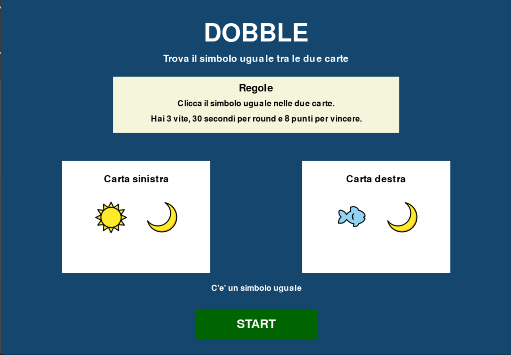
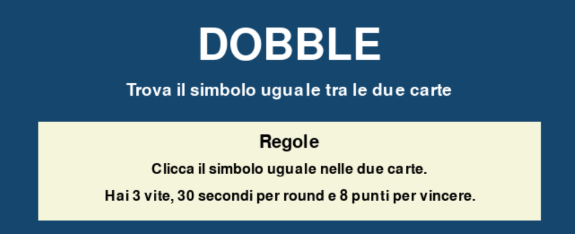
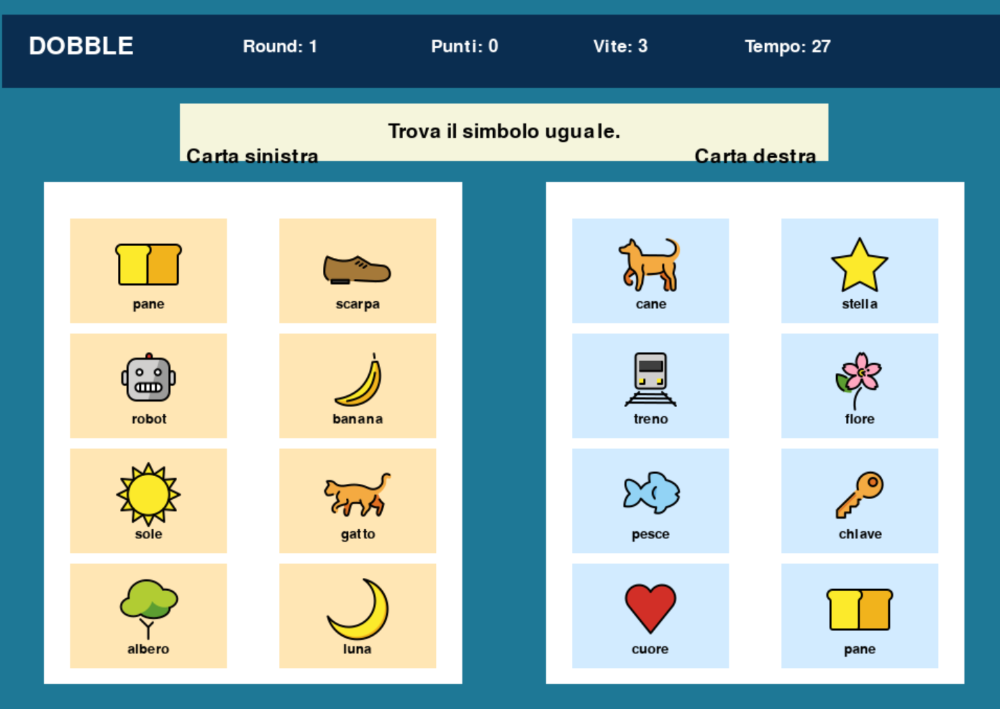
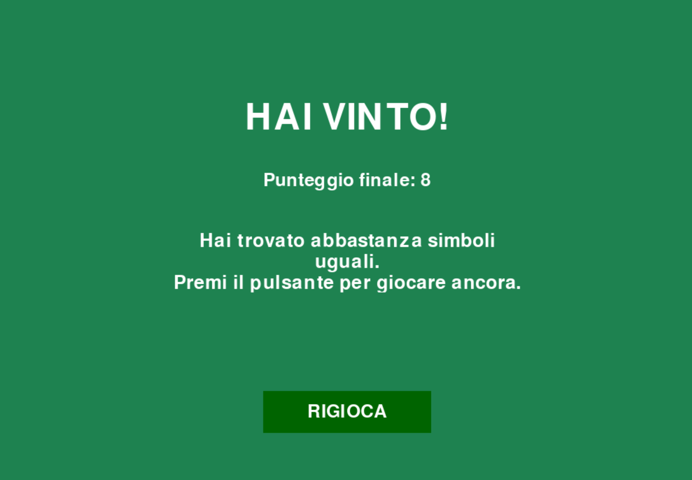
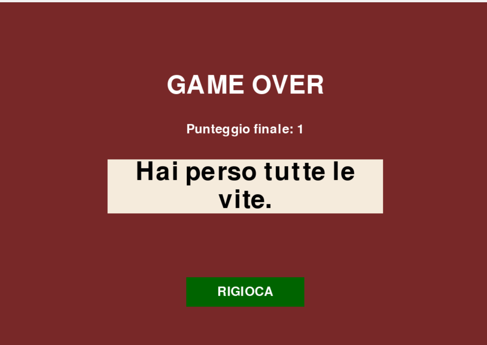

# Progetta il tuo gioco
## Esempio: DOBBLE

💻 **III Liceo Scientifico Biella - Scienze Applicate**
🐍 **Python Biella Group**

---
 
 
 

### 1. Tema e personaggi

DOBBLE è un gioco senza personaggi. Il tema è il riconoscimento visivo rapido: il giocatore osserva due carte piene di simboli e deve trovare il simbolo uguale presente su entrambe. Non ci sono nemici che si muovono: la sfida è contro il tempo e contro i propri errori.

**Immagine suggerita:** schermata introduttiva con due carte e simboli colorati.

---

 
 

### 2. Stati del gioco

**Menu iniziale** — il titolo DOBBLE è visibile, ci sono le regole principali, un esempio con due carte e il pulsante START. Il gioco spiega già che bisogna cliccare il simbolo uguale tra le due carte. Il codice mostra questa schermata nello stato `menu` prima che la partita inizi.

---

 
 

### 2. Stati del gioco

**Gioco in corso** — si vedono due carte principali, ognuna con 8 box cliccabili, il messaggio centrale, il numero del round, il punteggio, le vite e il tempo rimasto. Tutta la logica di partita attiva si trova nello stato `gioco`. fileciteturn3file0

---

 
 

### 2. Stati del gioco

**Vittoria** — quando il giocatore raggiunge il punteggio obiettivo, appare la schermata finale verde con il messaggio “HAI VINTO!” e il pulsante RIGIOCA. La vittoria viene attivata quando `punteggio >= PUNTEGGIO_OBIETTIVO`. fileciteturn3file0

---

 
 

### 2. Stati del gioco

**Game Over** — se finiscono le vite, oppure se scade il tempo e non restano vite, il gioco passa allo stato `game_over`, mostrando il punteggio finale, un messaggio di errore e il pulsante RIGIOCA. fileciteturn3file0

---

 
 
 

### 3. Come si vince e come si perde

**Tipo di gioco:** misto tra gioco a obiettivi e gioco a tempo.

**Condizione di vittoria:** raggiungere **N punti**, cioè trovare correttamente N simboli uguali nei round proposti. Il valore può essere impostato in una costante, es. `PUNTEGGIO_OBIETTIVO = 8`. 

---

 
 
 

**Condizione di sconfitta:**
- perdere tutte le **3 vite**;
- sbagliare troppe volte;
- far scadere il tempo del round fino a consumare tutte le vite;
- terminare i round disponibili prima di arrivare al punteggio richiesto. fileciteturn3file0

**Livelli:** non ci sono livelli veri e propri; la difficoltà resta costante, ma la pressione cresce perché ogni round ha un timer di **30 secondi**.

---

 
 
 

### 4. Azioni del giocatore

Il giocatore interagisce esclusivamente con il **mouse**:

- **Click su START** → avvia la partita
- **Click su un box della carta sinistra o destra** → seleziona un simbolo
- **Se il simbolo è corretto** → il punteggio aumenta di 1 e parte un nuovo round
- **Se il simbolo è sbagliato** → si perde una vita e parte un nuovo round
- **Click su RIGIOCA** → riavvia la partita dalla schermata finale

---

 
 
 

### 5. Oggetti del gioco - Carta (elemento principale)

| Aspetto | Dettaglio |
|---|---|
| Cosa fa | Contiene 8 simboli tra cui può esserci quello uguale all'altra carta |
| Come si muove | Non si muove, resta fissa sullo schermo |
| Stati possibili | visibile nel menu / attiva durante il gioco |
| Collisione | Non c'è collisione fisica; il contatto è il click del mouse dentro uno dei box `Rect(...)` |

---

 
 

### 5. Oggetti del gioco

Le due carte principali sono `carta_sinistra` e `carta_destra`, ognuna suddivisa in 8 aree cliccabili.

**Box cliccabili** — sono le zone rettangolari interne alle carte. Ogni box contiene un simbolo e può ricevere il click del giocatore. Nel codice sono definiti con molti `Rect(...)` separati e raccolti in due liste: `box_carta_sinistra` e `box_carta_destra`.

**Barra superiore** — mostra titolo, round, punti, vite e tempo.

**Area messaggi** — mostra testi come “Trova il simbolo uguale.”, “Corretto!” o “Sbagliato!”.

**Pulsanti** — `START` nel menu e `RIGIOCA` nelle schermate finali.

---

 
 
 

### 6. Grafica

**Sfondo:** colore pieno diverso per ogni schermata:
- blu per il menu,
- azzurro per il gioco,
- verde per la vittoria,
- rosso scuro per il game over. fileciteturn3file0

**Carte:** grandi rettangoli bianchi affiancati.

**Simboli:** immagini già presenti nella cartella `images` con nomi come `sole`, `luna`, `pesce`, `robot`, `banana`. Quando un simbolo ha l'immagine, il gioco usa `screen.blit(...)`; altrimenti scrive il testo.

---

 

### 6. Grafica

**Testo:** molto importante per guidare il giocatore. Il codice usa etichette grandi e leggibili per titolo, regole, timer, punteggio e messaggi di stato.

**Immagini esterne utili:** in questa versione servono davvero, perché i simboli vengono mostrati come file immagine se disponibili nella cartella `images`. L'elenco include, tra gli altri, `sole`, `gatto`, `albero`, `luna`, `cane`, `treno`, `fiore`, `chiave`, `robot`, `banana`.

---

 
 

### 7. Struttura del codice

Il file segue una struttura semplice ma chiara:

- **Costanti iniziali** → dimensioni finestra, tempo round, vite iniziali, punteggio obiettivo
- **`Rect(...)`** → definiscono carte, pulsanti e box cliccabili
- **`draw_*()`** → disegnano le varie schermate
- **`on_mouse_down()`** → intercetta i click del giocatore
- **`controlla_risposta()`** → decide se il click è corretto o sbagliato
- **`update_secondi_mancanti()`** → gestisce il timer del round 

---

 
 

### 8. Esempio di round

Ogni round è già pronto dentro `rounds_raw` e contiene:
- 8 simboli per la carta sinistra
- 8 simboli per la carta destra
- 1 simbolo comune dichiarato esplicitamente

Esempio: una stringa contiene due gruppi separati da `|` e il terzo pezzo è il simbolo uguale. Poi il codice divide le stringhe con `split("|")` e `split(";")`.

---

## Grazie per l'attenzione...

 

> *"C'è sempre qualcosa da imparare per migliorarci e crescere…**insieme!**"*
