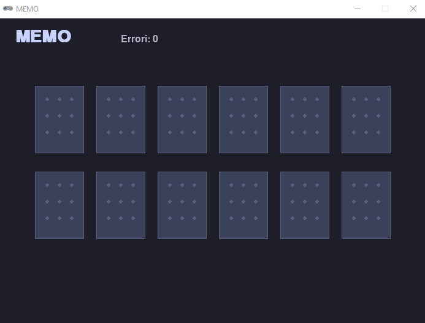
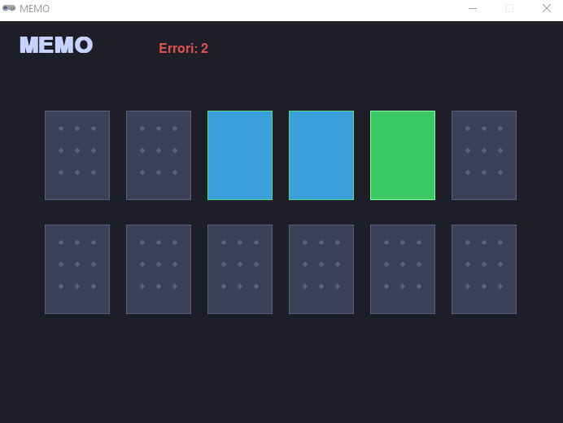
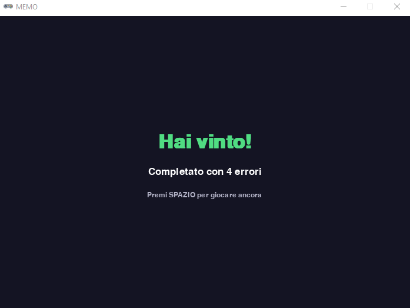

# Progetta il tuo gioco
## Esempio: MEMO

💻 **III Liceo Scientifico Biella - Scienze Applicate**
🐍 **Python Biella Group**

---

### 1. Tema e personaggi

MEMO è un gioco senza personaggi. Il tema è la memoria visiva: il giocatore deve ricordare la posizione di carte colorate coperte e trovarne le coppie, ad esempio 6. Non c'è protagonista né nemici — l'unico "avversario" è la propria memoria.

---

 

### 2. Stati del gioco

**Inizio** — le carte sono sul tavolo, tutte coperte. Il contatore errori è visibile.

---

 

### 2. Stati del gioco

**Gioco in corso** — le carte sono sul tavolo, il giocatore sta cercando le coppie. Il contatore errori è visibile.

---

 

### 2. Stati del gioco

**Vittoria** — tutte e 6 le coppie sono state trovate. Appare un overlay scuro con il messaggio di congratulazioni, il numero di errori commessi e il suggerimento per ricominciare.

---

 

### 3. Come si vince e come si perde

**Tipo di gioco:** a obiettivi — bisogna completare un'azione precisa (trovare tutte le coppie).

**Condizione di vittoria:** tutte le 12 carte sono state abbinate correttamente (6 coppie trovate).

**Condizione di sconfitta:** non esiste in questa versione. Il giocatore non può perdere; l'unica "penalità" è l'incremento del contatore errori ogni volta che sceglie due carte diverse. L'obiettivo implicito è finire con il minor numero di errori possibile.

**Livelli:** versione singola, nessuna progressione di difficoltà. Un'estensione possibile sarebbe aumentare il numero di coppie o ridurre il tempo di visibilità delle carte sbagliate.

---

 

### 4. Azioni del giocatore

Il giocatore interagisce esclusivamente con il **mouse** e la **tastiera**:

- **Click del mouse su una carta** → la carta si scopre mostrando il suo colore
- **Click su una seconda carta** → confronto automatico con la prima
  - Se i colori coincidono → le carte restano scoperte (coppia trovata)
  - Se i colori sono diversi → le carte si riscoprono dopo una breve pausa, errori +1
- **Tasto Spazio** (solo a fine partita) → avvia una nuova partita

---

 
 

### 5. Oggetti del gioco - Carta (elemento principale)

| Aspetto | Dettaglio |
|---|---|
| Cosa fa | Mostra o nasconde il suo colore in base allo stato |
| Come si muove | Non si muove — posizione fissa su una griglia 6×2 |
| Stati possibili | coperta / scoperta (temporaneamente) / trovata (definitivamente) |
| Collisione | Non c'è collisione fisica; il "contatto" è il click del mouse sull'area rettangolare della carta |

---

 

### 5. Oggetti del gioco

**Contatore errori** — testo che si aggiorna ogni volta che una coppia sbagliata viene selezionata. Diventa rosso non appena si commette il primo errore.

**Overlay di vittoria** — pannello che appare sopra tutto quando tutte le coppie sono scoperte, mostrando il risultato finale.

---

 

### 6. Grafica

**Sfondo:** rettangolo pieno di colore uniforme

**Carte coperte:** rettangolo più chiaro per suggerisce una carta da gioco generica.

**Carte scoperte:** rettangolo del colore della coppia (rosso, azzurro, verde, giallo, viola, arancione)

---

 

### 6. Grafica

**Testo:** titolo "MEMO" in alto a sinistra chiaro; contatore errori al centro in alto

**Nessuna immagine esterna necessaria** — tutta la grafica può essere disegnata con le primitive di Pygame Zero

---

## Grazie per l'attenzione...

 

> *"C'è sempre qualcosa da imparare per migliorarci e crescere…**insieme!**"*
